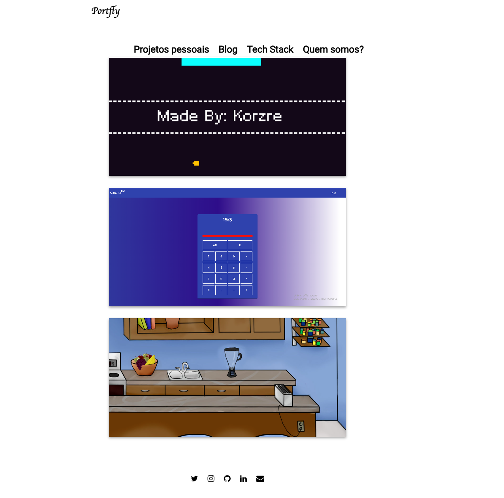
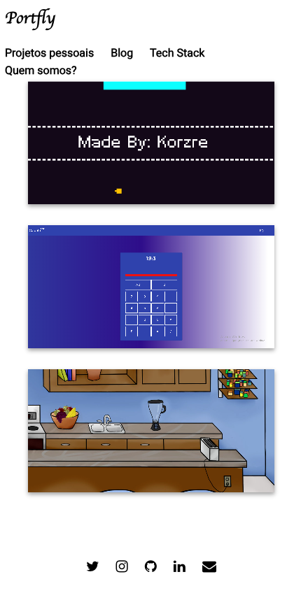

# Portfly Blog

[](https://jekyllrb.com/)
[](https://www.ruby-lang.org/)
[](https://sass-lang.com/)
[](https://developer.mozilla.org/en-US/docs/Web/JavaScript)

O **Portfly** é um blog e portfólio pessoal estático desenvolvido com Jekyll e Ruby, projetado para a publicação de artigos sobre programação, desenvolvimento de software e apresentação de projetos pessoais.

---

## Interface

<div align="center">
  <table>
    <tr>
      <td align="center"><b>Home & Projetos</b></td>
      <td align="center"><b>Artigos</b></td>
      <td align="center"><b>Versão Mobile</b></td>
    </tr>
    <tr>
      <td></td>
      <td></td>
      <td></td>
    </tr>
  </table>
</div>

---

## Tecnologias Utilizadas

* **Gerador Estático:** Jekyll
* **Linguagem Base:** Ruby
* **Estilização:** Sass / CSS3
* **Scripts:** JavaScript
* **Estrutura:** HTML5

---

## Estrutura do Repositório

O código-fonte e a configuração completa da aplicação estão localizados dentro do diretório `/blog-finnish`.

---

## Instalação e Uso

### Pré-requisitos

Certifique-se de ter o Ruby e o Bundler instalados em seu ambiente. Para obter instruções detalhadas de configuração do ecossistema Ruby, consulte a [documentação de instalação do Jekyll](https://jekyllrb.com/docs/installation/).

### Executando localmente

   1. Clone o repositório:
   ```bash
   git clone https://github.com/Korzre/blog-portfly.git
   ```

   2. Navegue até o diretório da aplicação:
   ```bash
   cd blog-portfly/blog-finnish
   ```

   3. Instale as dependências da Gemfile:
   ```bash
   bundle install
   ```

   4. Inicie o servidor de desenvolvimento local:
   ```bash
   bundle exec jekyll serve
   ```

   5. Acesse http://127.0.0.1:4000 no navegador para visualizar o site.
   
   
